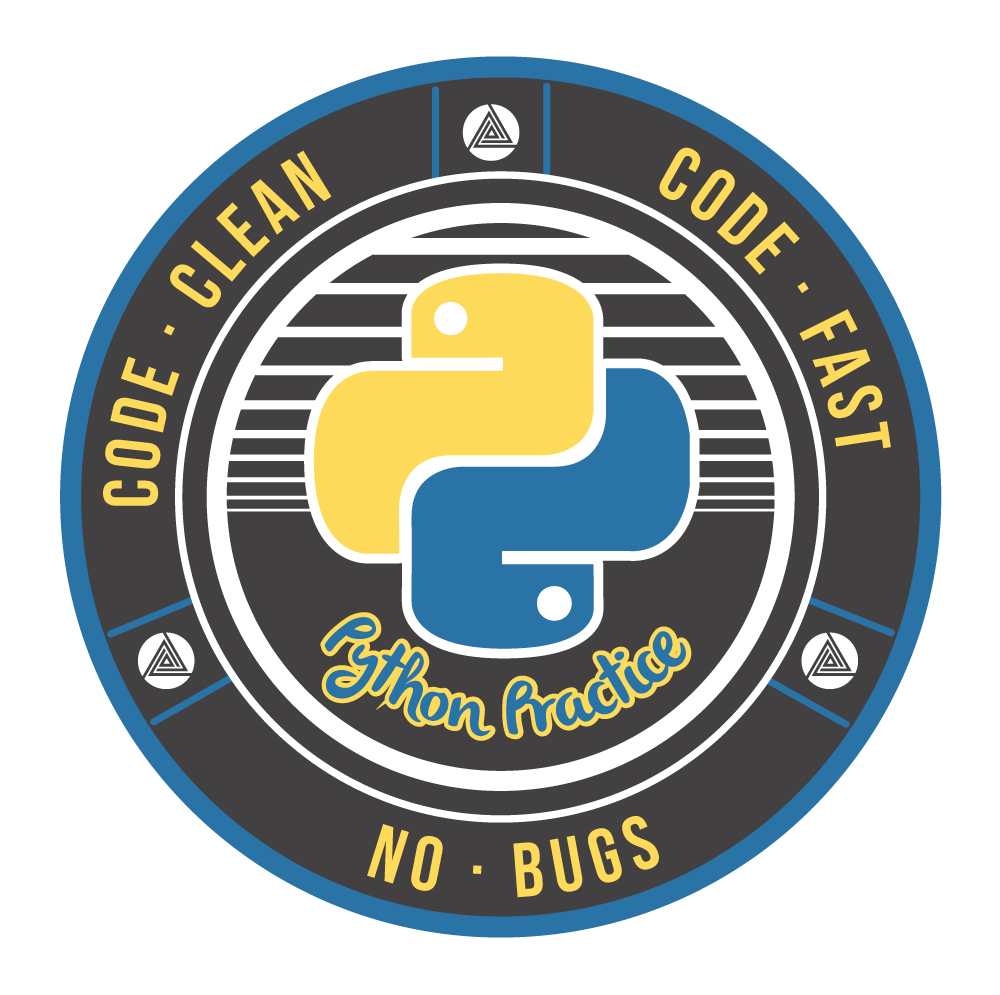

<h1 style="text-align: center;"><strong>Python Training: Fundamentals</strong></h1>

|   	|          COURSE         	| TOPICS                                                                                                                                                                                                                  	| SESSION VIDEO 	|
|---	|:-----------------------:	|-------------------------------------------------------------------------------------------------------------------------------------------------------------------------------------------------------------------------	|---------------	|
| 1 	| Python Fundamentals: 01 	| - History of Python   - How it works?   - PIP   - Virtualenv   - Python V2 vs Python V3   - Python Zen   - PEP 8   - IDE                                                                        	|               	|
